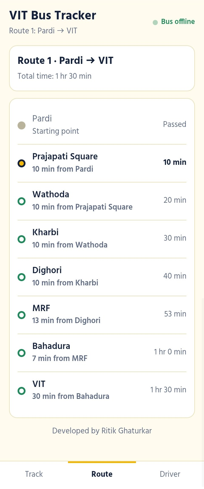

# 🚌 VIT College Bus Tracker

A simple, free, mobile-friendly web app that lets students **track their college bus live** and see **route, stops and ETA**.
Drivers share their phone's GPS location, and students see the bus move on the route in real time.

**Live app:** https://ritikghaturkar677-ai.github.io/Bus-tracking-application-/index.html
**Driver panel:** https://ritikghaturkar677-ai.github.io/Bus-tracking-application-/driver.html

---

## ✨ Features

- 📍 **Live bus tracking** using the driver's phone GPS
- ⏱️ **ETA** to the next stop, to the student's own stop, and to VIT
- 🗺️ **Route map** with all stops and the moving bus
- 🛣️ **3 bus routes** with separate drivers (select route from the Driver tab)
- 📞 **Driver info** with one-tap Call and WhatsApp buttons
- 🔐 **Driver login** (email + password), only drivers can send location
- 📱 **Add to Home screen** works like a mobile app (PWA-style)
- 🌗 Light and dark mode

---

## 📸 Screenshots

<table>
  <tr>
    <td align="center"><b>Track</b><br></td>
    <td align="center"><b>Route &amp; ETA</b><br></td>
  </tr>
</table>

---

## 🛣️ Routes

| Route | Path |
|-------|------|
| **Route 1** | Pardi → Prajapati Square → Wathoda → Kharbi → Dighori → MRF → Bahadura → VIT |
| **Route 2** | Kamal Square → Dahi Bazar → Azad Chowk → Telephone Exchange → Nandanvan → Bhande Plot → Dighori → VIT |
| **Route 3** | Jivan Vikas Chowk → Bhisi Naka → Kawrapeth → WCC → Udasa → UTI → VIT |

> Stop timings and coordinates for Route 2 and Route 3 are being finalised.

---

## 🧰 Tech Stack

- **Frontend:** HTML, CSS, JavaScript (no framework)
- **Backend:** Firebase Realtime Database + Firebase Authentication
- **Hosting:** GitHub Pages (HTTPS)
- **Location:** Browser Geolocation API

---

## 🔧 How it works

```
Driver phone (driver.html)  ──GPS──▶  Firebase Realtime Database  ──▶  Student phone (index.html)
        login + Start Trip               stores bus location              shows bus, ETA, route
```

1. The driver logs in and taps **Start Trip**. The phone's GPS location is sent to Firebase every few seconds.
2. The student app reads the location live and finds where the bus is on the route.
3. ETA is calculated from the planned minutes between stops.

---

## 📂 Project structure

```
├── index.html     # Student app (track, route, driver info)
├── driver.html    # Driver panel (login, select route, start/stop trip)
└── README.md
```

---

## 🚀 Setup (for your own copy)

1. Create a project at [Firebase Console](https://console.firebase.google.com).
2. Enable **Realtime Database** and **Authentication → Email/Password**. Create driver users.
3. Add a **Web app** and copy the Firebase config.
4. Paste the config into `FIREBASE_CONFIG` in **both** `index.html` and `driver.html`.
5. In `index.html`, update the `BUSES` block (drivers, stops, minutes) and `COORDS` (real latitude/longitude of each stop).
6. Upload the files to GitHub and enable **Settings → Pages → Deploy from branch (main, root)**.
7. In Firebase → Authentication → Settings → **Authorized domains**, add your `github.io` domain.
8. Set Realtime Database rules so that only the driver of each bus can write its location.

Example rules (replace the UIDs with your drivers' Firebase user IDs):

```json
{
  "rules": {
    "bus1": { ".read": true, ".write": "auth != null && auth.uid === 'DRIVER1_UID'" },
    "bus2": { ".read": true, ".write": "auth != null && auth.uid === 'DRIVER2_UID'" },
    "bus3": { ".read": true, ".write": "auth != null && auth.uid === 'DRIVER3_UID'" }
  }
}
```

---

## 📱 How to use

**Students**
1. Open the app link in Chrome.
2. Go to the **Driver** tab and select your route.
3. Open the **Track** tab, choose **My stop** and see when the bus will arrive.

**Drivers**
1. Open the driver link in **Chrome** and log in.
2. Select your route and tap **Start Trip**. Allow Location.
3. Keep the screen on during the trip. Tap **Stop Trip** when finished.

---

## ⚠️ Limitations

- The driver's screen must stay on, because browsers pause GPS in the background. A native Android app can remove this limit.
- ETA is based on planned minutes between stops, not live traffic.
- Needs mobile internet and GPS on the driver's phone.

---

## 🛣️ Future plans

- Android app (Capacitor) with background GPS
- Real Google Maps view
- Departure times and notifications ("bus is arriving")
- Student registration

---

## 👨‍💻 Developed by

**Ritik Ghaturkar**

Made for VIT students to make daily bus travel easier. 🚌
